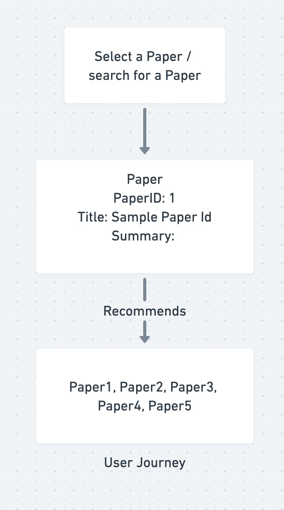

#  Data606- Capstone Project Proposal
 
## 1. PaperCraft- Craft Your Research Journey using Smart Paper Recommendation Engine

- **PaperCraft**
- Prepared for UMBC Data Science Master Degree Capstone by Dr Chaojie (Jay) Wang
- Author Name - Vishnu Priya Thanda
-   
- 
- PowerPoint presentation file - (Should be inside Github docs)
- YouTube video Link - In Progress
    
## 2. Background

In the ever-expanding landscape of academic research, scholars and researchers often face the daunting task of sifting through an overwhelming amount of information to discover relevant research papers. The advent of Natural Language Processing (NLP) has opened new avenues for simplifying this process by leveraging machine learning algorithms to analyze, categorize, and recommend research papers based on user input.

In this context, the proposed project aims to develop a cutting-edge research paper recommendation system powered by NLP technology. This system will address the pressing need for an intelligent tool that assists scholars and researchers in efficiently discovering papers tailored to their specific interests and research objectives. By harnessing the capabilities of NLP, this project seeks to provide users with a personalized and intuitive experience for navigating the vast realm of academic literature. 

**Research Questions**

- How can NLP techniques be effectively employed to analyze and extract key information from research papers and user input?
- What factors contribute to the personalization of research paper recommendations?
- How can the quality and relevance of recommended research papers be measured and evaluated effectively?
- What user interface and interaction design principles should be employed to ensure user-friendliness and usability of the recommendation system?

By addressing the above research questions, this project aims to contribute to the development of a sophisticated NLP-based research paper recommendation system that revolutionizes the way scholars and researchers access and engage with academic literature.

## 3. Data 

Describe the datasets you are using to answer your research questions.

- Data sources - A custom dataset has been prepared by scraping the metadata of research papers from the <a href="https://export.arxiv.org/">ArXiv API</a>. Parameters such as category, sorting order, and keyword were used to search for papers on ArXiv to create our dataset.

- Data size: 11 MB
- Data shape: 9500 Rows and 5 Columns
- Time period: None
- Feature Variable: Summary
- Output: Relevant Papers (Links to the Paper)
- Each row represents the information of a particular research paper.
- Data dictionary:

  |   Column   |   Dtype   |       Definition       |
  |------------|-----------|------------------------|
  |     Id     |   object  |   Serial Number        |
  |    Title   |   object  |   Title of the Paper   |
  |   Summary  |   object  |   Summary of the Paper |
  |   Authors  |   object  |   Author of the Paper  |
  | Published  |   object  |   Date of the paper Published       |
  |    Link    |   object  |   Link to the paper Published       |

### System Architecture

## 4. Exploratory Data Analysis (EDA)

- Perform data exploration using Jupyter Notebook
- You would focus on the target variable and the selected features and drop all other columns.
- produce summary statistics of key variables
- Create visualizations (I recommend using **Plotly Express**)
- Find out if the data require cleansing:
  - Missing values?
  - Duplicate rows? 
- Find out if the data require splitting, merging, pivoting, melting, etc.
- Find out if you need to bring in other data sources to augment your data.
  - For example, population, socioeconomic data from Census may be helpful.
- For textual data, you will pre-process (normalize, remove stopwords, tokenize) them before you can analyze them in predictive analysis/machine learning.
- Make sure the resulting dataset need to be "tidy":
  - each row represent one observation (ideally one unique entity/subject).
  - each columm represents one unique property of that entity. 

## 5. Model Training 

- What models you will be using for predictive analytics?
  ### Models for Predictive Analytics:
 For our ML Paper Recommendation System, we will be utilizing advanced embedding models. Specifically, I have combined SPECTER 2.0 with  Sentence Transformers for a more comprehensive understanding of paper content and context. I have chosen Sentence Transformers due to its 
 ability to capture contextual information effectively. These models have been pre-trained on large datasets, making them suitable for our 
 recommendation task.
 SPECTER 2.0 (Spectral Embedding from Citations and Titles for Efficient Retrieval) is a cutting-edge model specifically designed for 
 scientific paper recommendation and exploration. It goes beyond traditional keyword-based approaches by leveraging the rich network of 
 citations between papers, offering a more nuanced and insightful understanding of scientific knowledge and relationships.
 This has lead to more accurate and nuanced recommendations, taking into account both textual and citation-based information.
   
- How will you train the models?

 The model training process will heavily rely on Python, utilizing popular machine learning and NLP packages. Specifically, we will 
 leverage scikit-learn for general machine learning tasks, and Hugging Face's Transformers library for working with pre-trained transformer 
 models like Sentence Transformers. These packages offer a rich set of tools for model development, training, and evaluation.
 Python packages to be used are scikit-learn, NLTK, spaCy, streamlit, pandas, PIL etc.
 The development environments I have used are Google CoLab and VSCode on my personal laptop.

- How will you measure and compare the performance of the models?

We will employ multiple metrics to measure and compare the performance of our ML Paper Recommendation System.
  ### Cosine Similarity:
  Since our recommendation system relies on embeddings and Sentence Transformers, we will measure the similarity between recommended papers and user queries using cosine similarity. A higher cosine similarity indicates a more relevant recommendation.
  ### User Feedback and Interaction Metrics:
  To incorporate user feedback, we may consider metrics related to user interaction, such as click-through rates or time spent on recommended papers. This user-centric evaluation helps ensure that the recommendations align with the user's needs and preferences.

## 6. Application of the Trained Models

### Streamlit Framework:
* The web app is built using the Streamlit framework, a powerful and user-friendly Python library for creating interactive web applications. Streamlit allows for rapid development and deployment, making it an ideal choice for our project. This seamlessly integrates with our trained Paper Recommendation System. The model processes user queries and returns relevant recommendations in real-time, creating a dynamic and responsive user experience.
* Intuitive User Interface:
    * The web app boasts a clean and intuitive user interface, making it accessible to both seasoned researchers and newcomers in the field. Users can easily navigate through the app to input their queries ore research topic and receive personalized recommendations.
* Query Input and Customization:
    * Users can input their queries, topics, or keywords directly into the app. The system takes advantage of advanced NLP techniques to understand and process these inputs, providing accurate and contextually relevant recommendations.

## 7. Conclusion

- Summarize your work and its potetial application
- Point out the limitations of your work
- Lessons learned 
- Talk about future research direction

We were able to create a recommendation system that helps researchers to find relevant papers for their research. The app was developed using Streamlit UI, providing a user-friendly interface for researchers to find information with ease. And it helps researchers stay up to date with the latest research.

We can also use diverse algorithms, such as collaborative filtering based on user interactions. Collaborative filtering is a technique used by recommender systems to make automatic predictions about the interests of a user by effectively capturing preferences or information from the users. It can significantly improve the performance and personalization of recommender systems.

The adoption of advanced embedding models such as Specter and new models like Ada from OpenAI can enhance the semantic understanding of research papers, leading to more accurate paper recommendations. As these are specifically designed for research content, this will outperform the other models like TF-IDF and Sentence Transformers.

## 8. References 

List articles, blogs, and websites that you have referenced or used in your project.
