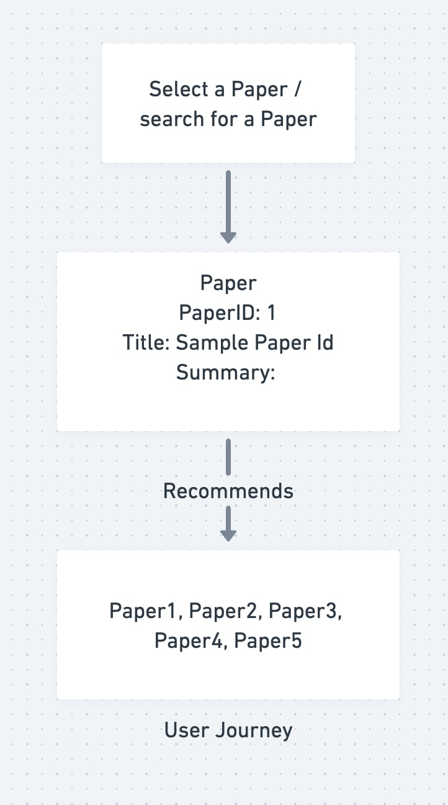
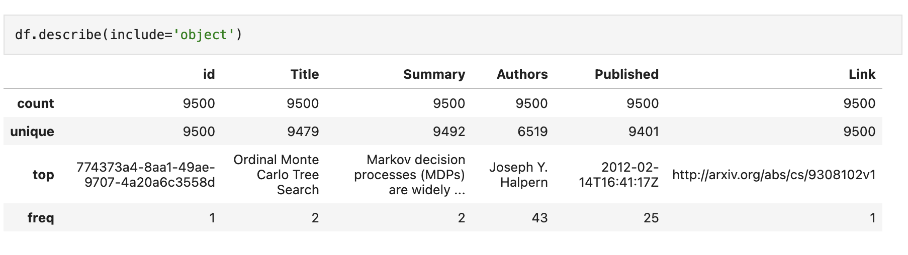
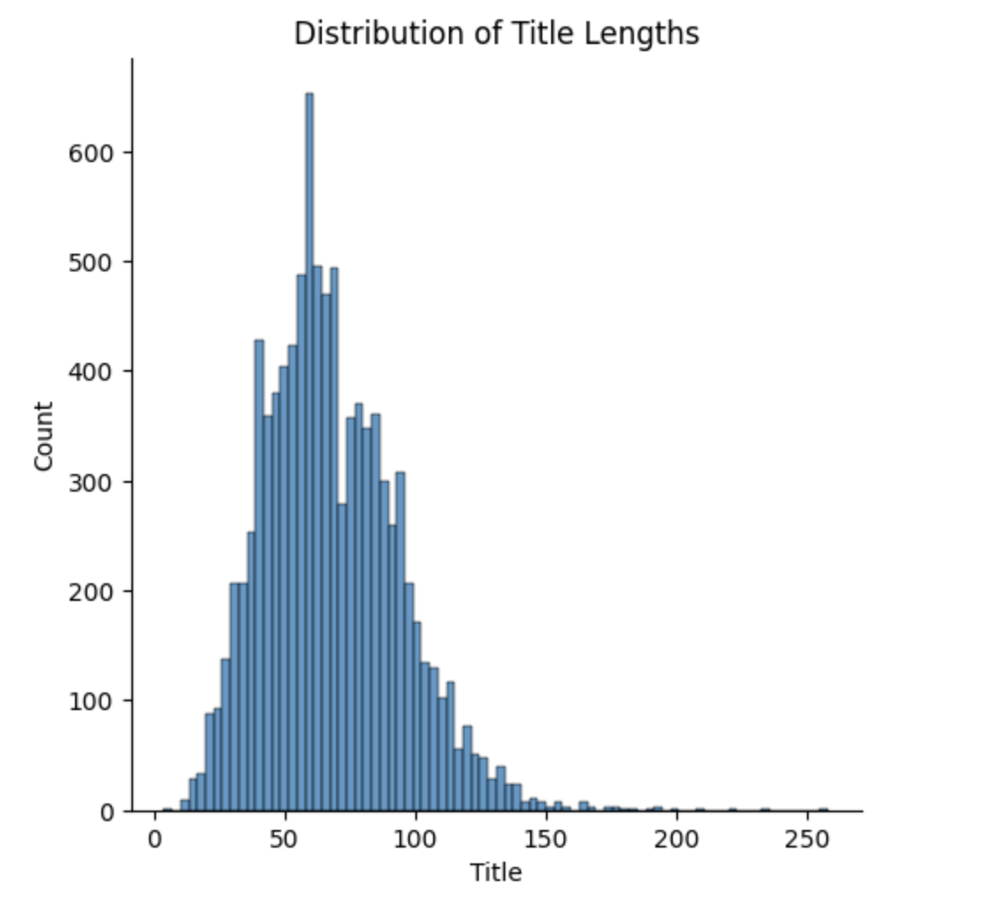
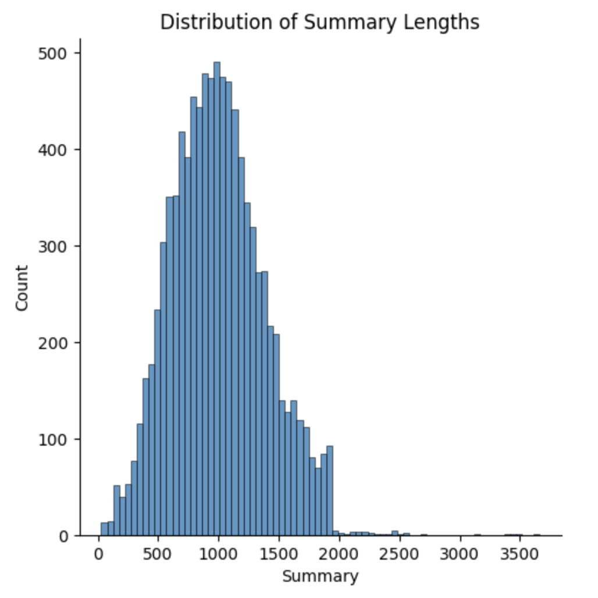
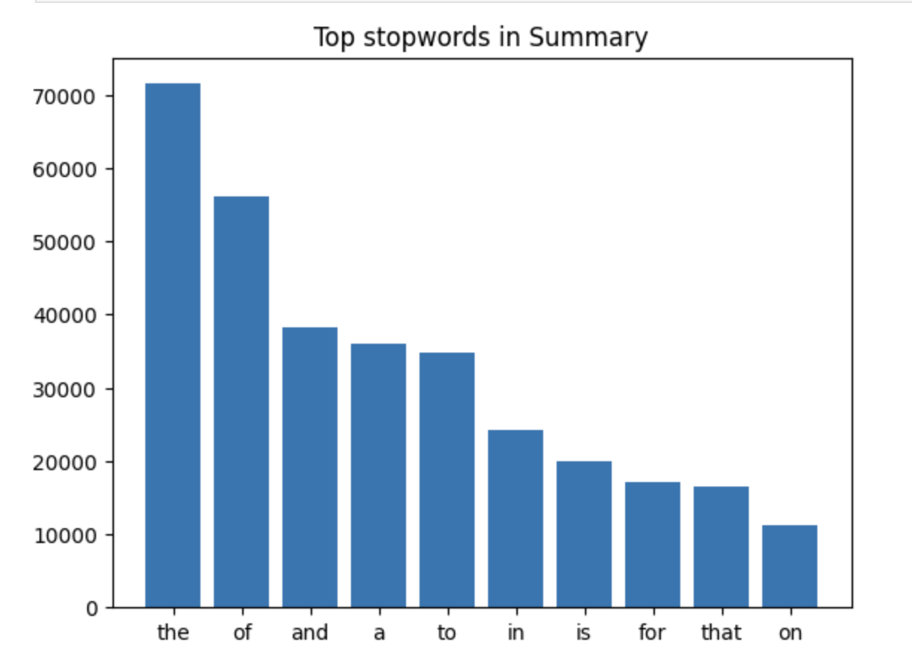
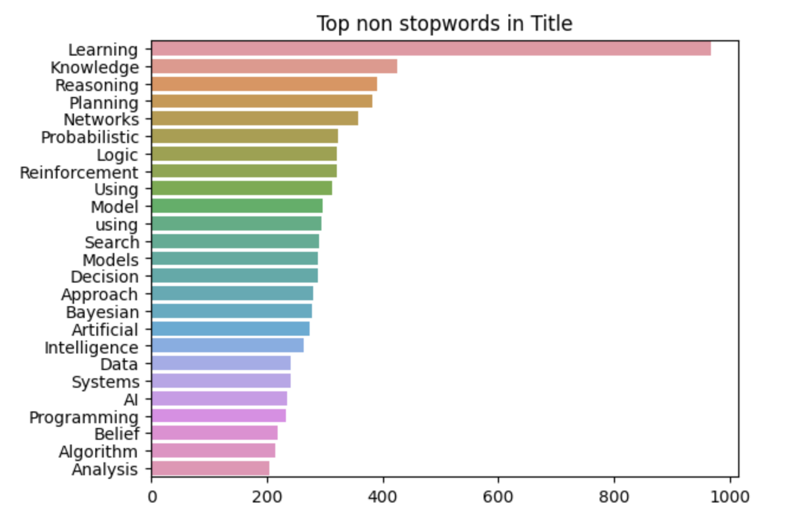
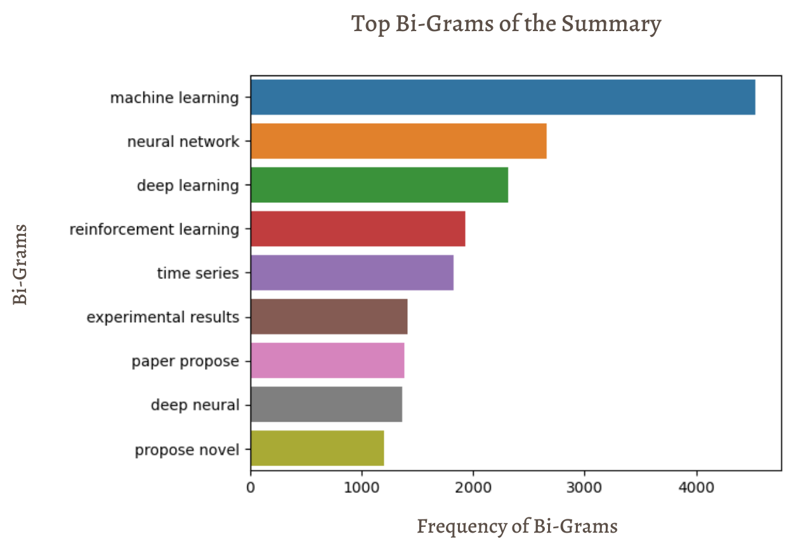
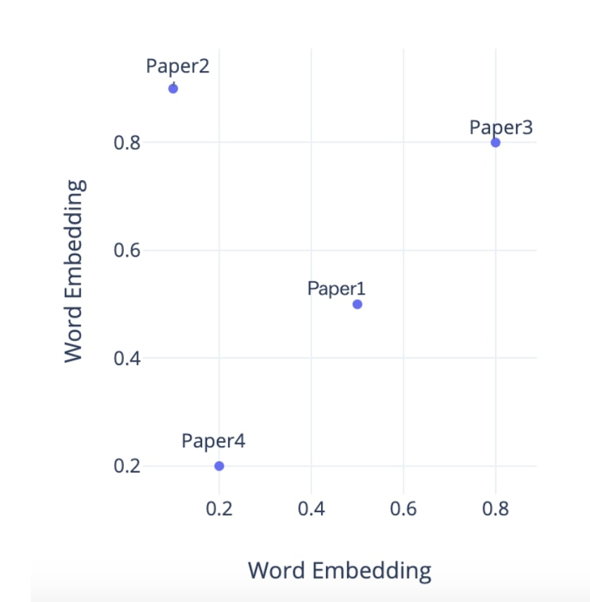

#  DATA 606 Capstone Report
 
## 1. Title and Author
- **PaperCraft**
- Prepared for UMBC Data Science Master Degree Capstone by Dr Chaojie (Jay) Wang
- **Author Name** - Vishnu Priya Thanda
- **Semester** - FALL 2023
-   
- 
-   
- YouTube video Link - In Progress
    
## 2. Background

In the ever-expanding landscape of academic research, scholars and researchers often face the daunting task of sifting through an overwhelming amount of information to discover relevant research papers. The advent of Natural Language Processing (NLP) has opened new avenues for simplifying this process by leveraging machine learning algorithms to analyze, categorize, and recommend research papers based on user input.

In this context, the proposed project aims to develop a cutting-edge research paper recommendation system powered by NLP technology. This system will address the pressing need for an intelligent tool that assists scholars and researchers in efficiently discovering papers tailored to their specific interests and research objectives. By harnessing the capabilities of NLP, this project seeks to provide users with a personalized and intuitive experience for navigating the vast realm of academic literature. 

**Research Questions**

- How can NLP techniques be effectively employed to analyze and extract key information from research papers and user input?
- What factors contribute to the personalization of research paper recommendations?
- How can the quality and relevance of recommended research papers be measured and evaluated effectively?
- What user interface and interaction design principles should be employed to ensure user-friendliness and usability of the recommendation system?

By addressing the above research questions, this project aims to contribute to the development of a sophisticated NLP-based research paper recommendation system that revolutionizes the way scholars and researchers access and engage with academic literature.

## 3. Data 

Describe the datasets you are using to answer your research questions.

- Data sources - A custom dataset has been prepared by scraping the metadata of research papers from the <a href="https://export.arxiv.org/">ArXiv API</a>. Parameters such as category, sorting order, and keyword were used to search for papers on ArXiv to create our dataset.

- Data size: 11 MB
- Data shape: 9500 Rows and 5 Columns
- Time period: None
- Feature Variable: Summary
- Output: Relevant Papers (Links to the Paper)
- Each row represents the information of a particular research paper.
- Data dictionary:

  |   Column   |   Dtype   |       Definition       |
  |------------|-----------|------------------------|
  |     Id     |   object  |   Serial Number        |
  |    Title   |   object  |   Title of the Paper   |
  |   Summary  |   object  |   Summary of the Paper |
  |   Authors  |   object  |   Author of the Paper  |
  | Published  |   object  |   Date of the paper Published       |
  |    Link    |   object  |   Link to the paper Published       |

### System Architecture

## 4. Exploratory Data Analysis (EDA)

EDA has laid a robust foundation for the subsequent stages of our model development. By focusing on key variables, utilizing visualizations, and ensuring data cleanliness and tidiness, I am well-prepared for the predictive analytics phase. The insights gained from this exploration will guide our modeling decisions and contribute to the effectiveness of the final recommendation system.

1. Perform Data Exploration:
My data exploration focused on understanding the key variables related to our ML Paper Recommendation System. I began by identifying the target variable which is “Summary” and selected features critical to our recommendation model.

2. Summary Statistics:
Summary statistics were generated for key variables, providing insights into the distribution and characteristics of the data. This step served as a foundation for understanding the central tendencies and variabilities in our dataset.

3. Visualizations:
Utilizing various plots, I crafted interactive visualizations to uncover patterns, trends, and potential relationships within the data. Visualizations included histograms, box plots, and scatter plots, enhancing our understanding of variable distributions and potential outliers.

Below are few plots which shows us the length of titles, summary, top stopwords and non stopwords along with top bi-grams.

By analyzing top stop words, N-grams and the length of titles and summaries in research papers, it helped me identify the most important words and phrases that are relevant to a particular topic and understand the dataset better. This analysis can help in improving the accuracy of the recommendation system by ensuring that the recommended papers are closely related to the user's interests.

4. Data Cleansing:
I investigated the need for data cleansing by addressing missing values and identifying duplicate rows. This process ensured the integrity of our dataset and mitigated potential biases in subsequent analyses. As of now, there are no missing values in the dataset.

5. Augmentation with External Data:
To enrich the dataset, I explored the incorporation of external data sources. A custom dataset has been prepared by scraping the metadata of research papers from the <a href="https://export.arxiv.org/">ArXiv API</a>.

6. Pre-processing for Textual Data:
For textual data, a crucial aspect of our recommendation system, I implemented pre-processing steps. This involved normalization, removal of stop words, and tokenization, ensuring that the textual data is appropriately prepared for analysis and modeling. 
  
Post EDA, the resulting dataset adheres to the principles of tidy data. Each row represents a unique observation or paper, while each column corresponds to a specific property or feature associated with that paper. 

## 5. Model Training

Embeddings are a powerful technique in natural language processing that allows us to represent text as a
high-dimensional vector in a continuous space. This vector representation captures the semantic meaning
of the text and allows us to perform various tasks such as classification, clustering, and recommendation.
In our recommendation system, embeddings are particularly useful as they allow us to compare the semantic
similarity of two research papers based on their abstracts. Traditional methods such as keyword-based
search or metadata-based filtering may not capture the full semantic meaning of the text and may miss
important relationships between papers.

Embeddings can be created using different methods like TF-IDF, word2vec, and BERT-based models, each capturing distinct text aspects.
 
 1. TF-IDF Embeddings

 TF-IDF (Term Frequency-Inverse Document Frequency) is a widely used technique that measures the
importance of a word in a document by considering its frequency in the document and in the corpus. In my
implementation, I used the Scikit-learn implementation of TF-IDF to generate embeddings for the paper
abstracts. However, it is worth noting that TF-IDF embeddings only capture the frequency information of
the words and may not be able to capture the semantic meaning of the text.

2. Sentence Transformers

To overcome the limitations of TF-IDF, I also utilized Sentence-Transformers to generate embeddings
for the paper abstracts. Sentence-Transformers are pre-trained models that can generate embeddings for
sentences, based on transformer architectures such as BERT and RoBERTa. In my implementation, I used
the pre-trained model called "bert-base-nli-mean-tokens" to generate embeddings for the paper abstracts.
The Sentence-Transformers embeddings captured the text's semantic meaning and provided more accurate
similarity scores compared to TF-IDF.

3. Specter 2.0 (BERT based)

Specter2.0 is a state-of-the-art document embedding model that was developed by the Allen Institute for
AI. The model was trained on a large corpus of scientific papers, which makes it particularly well-suited
for generating embeddings for research papers. It uses a BERT-based architecture to generate embeddings
for each sentence in a document. These sentence embeddings are then combined using a pooling strategy
to generate a single document embedding. The resulting embedding captures the semantic meaning of the
entire document and can be used for various downstream tasks such as classification, clustering, and
recommendation.

I also trained a hugginface transformer based model with Neural Networks for embedding generation, but because of the GPU constraints I couldn't use that model, I've used Specter 2.0 model for the recommendation system.
We will employ multiple metrics to measure and compare the performance of our ML Paper Recommendation System.
  ### Cosine Similarity:
  Since our recommendation system relies on embeddings and Sentence Transformers, we will measure the similarity between recommended papers and user queries using cosine similarity. A higher cosine similarity indicates a more relevant recommendation.
  ### User Feedback and Interaction Metrics:
  To incorporate user feedback, I considered metrics related to user interaction also, I've showed this application and got feedback from my friends.

## 6. Application of the Trained Models

### Streamlit Framework:
* The web app is built using the Streamlit framework, a powerful and user-friendly Python library for creating interactive web applications. Streamlit allows for rapid development and deployment, making it an ideal choice for our project. This seamlessly integrates with our trained Paper Recommendation System. The model processes user queries and returns relevant recommendations in real-time, creating a dynamic and responsive user experience.
* Intuitive User Interface:
    * The web app boasts a clean and intuitive user interface, making it accessible to both seasoned researchers and newcomers in the field. Users can easily navigate through the app to input their queries ore research topic and receive personalized recommendations.
* Query Input and Customization:
    * Users can input their queries, topics, or keywords directly into the app. The system takes advantage of advanced NLP techniques to understand and process these inputs, providing accurate and contextually relevant recommendations.

## 7. Conclusion

We have created a recommendation system that helps researchers to find relevant papers for their research. The app was developed using Streamlit UI, providing a user-friendly interface for researchers to find information with ease. And it helps researchers stay up to date with the latest research.

We can also use diverse algorithms, such as collaborative filtering based on user interactions. Collaborative filtering is a technique used by recommender systems to make automatic predictions about the interests of a user by effectively capturing preferences or information from the users. It can significantly improve the performance and personalization of recommender systems.

The adoption of advanced embedding models such as Specter and new models like Ada from OpenAI can enhance the semantic understanding of research papers, leading to more accurate paper recommendations. As these are specifically designed for research content, this will outperform the other models like TF-IDF and Sentence Transformers.

## 8. References 

[1] API for arXiv Categorization - arXiv info. (n.d.). Info.arxiv.org. Retrieved September 16, 2023, from https://info.arxiv.org/help/api/classify.html

[2] ‌Scientific Paper Recommendation System | IEEE Conference Publication | IEEE Xplore. (n.d.). Ieeexplore.ieee.org. Retrieved October 10, 2023, from https://ieeexplore.ieee.org/document/10126196

[3] Word embeddings | Text. (n.d.). TensorFlow. https://www.tensorflow.org/text/guide/word_embeddings

‌
[4] Pretrained Models — Sentence-Transformers documentation. (n.d.). https://www.sbert.net/docs/pretrained_models.html
‌

[5] allenai/specter2 · Hugging Face. (2023, October 19). Huggingface.co. https://huggingface.co/allenai/specter2
